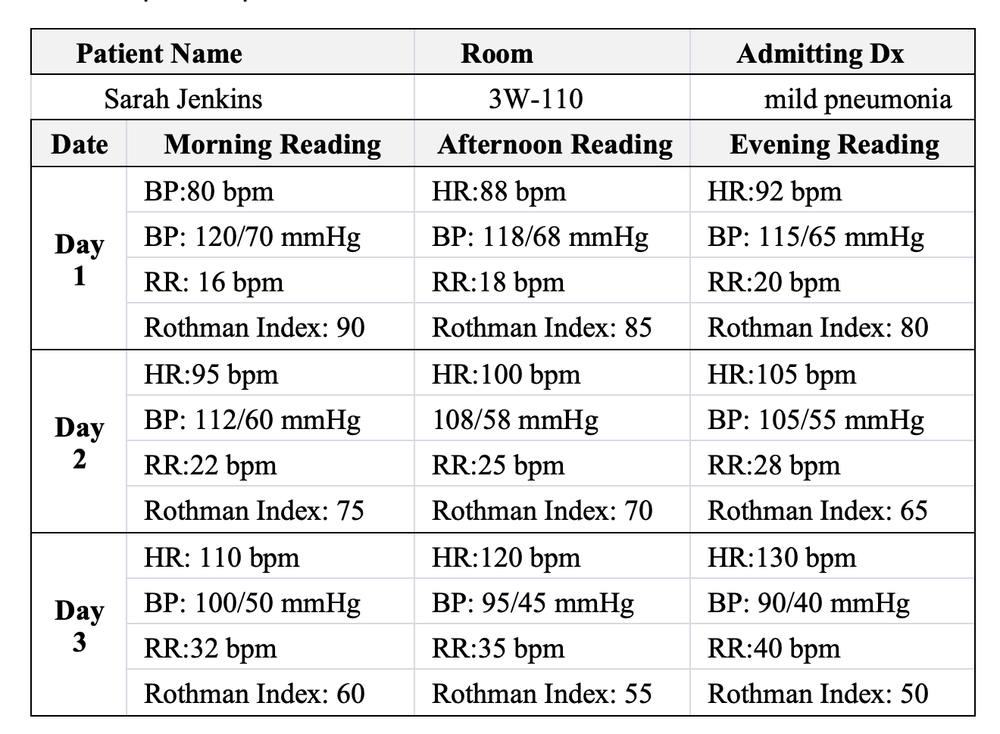
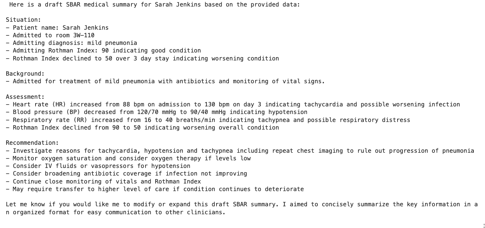
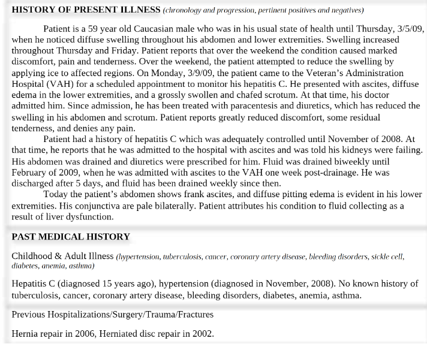
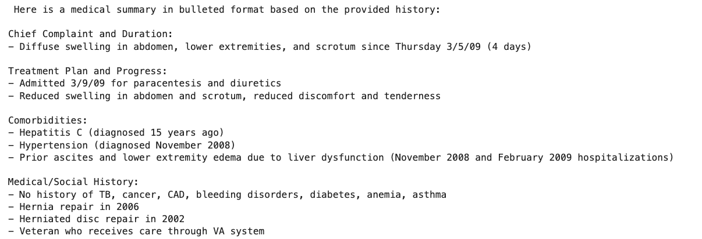
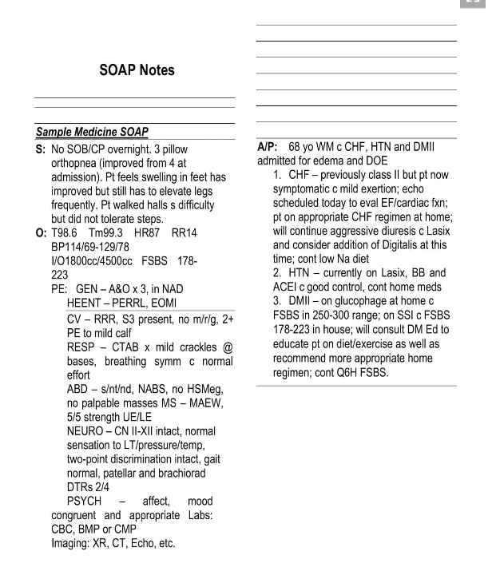
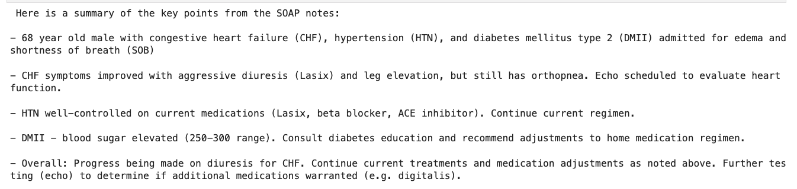

# Healthcare clinical notes extraction, summarization in standard clinical reporting format
This repository will highlight leveraging power of LLM to uncover insights from unstructured disparate medical/clinical notes and standardize/summarize it in medical standard clinical reporting format like SBAR 

# Healthcare Usecase 1:  - Data extraction and Summarization of clinical notes in SBAR format
In this example we will be extracting a wide range of tabular data and summarize it in standard SBAR structure. SBAR is an acronym for Situation, Background, Assessment, Recommendation; a technique that can be used to facilitate prompt and appropriate communication. This communication model has gained popularity in healthcare settings, especially amongst professions such as physicians and nurses. It is a way for health care professionals to communicate effectively with one another, and also allows for important information to be transferred accurately. The format of SBAR allows for short, organized and predictable flow of information between professionals.

## Input and output 

  --->>  !

## [Solution notebook](/usecase1.ipynb)

# Healthcare Usecase 2:  - Extract data and create structured insights from medical history images and unstructured data.
In this example we will be extracting text from medical history images and create medical insights and summary from it.

## Input and output 

Example 1: 
  --->>  !

Example 2: 
  --->>  !

## [Solution notebook](/usecase2.ipynb)

# Stay in touch and connect with me
Connect and follow me on [Linkedin](https://www.linkedin.com/in/neelam-koshiya-3b8407120/)

